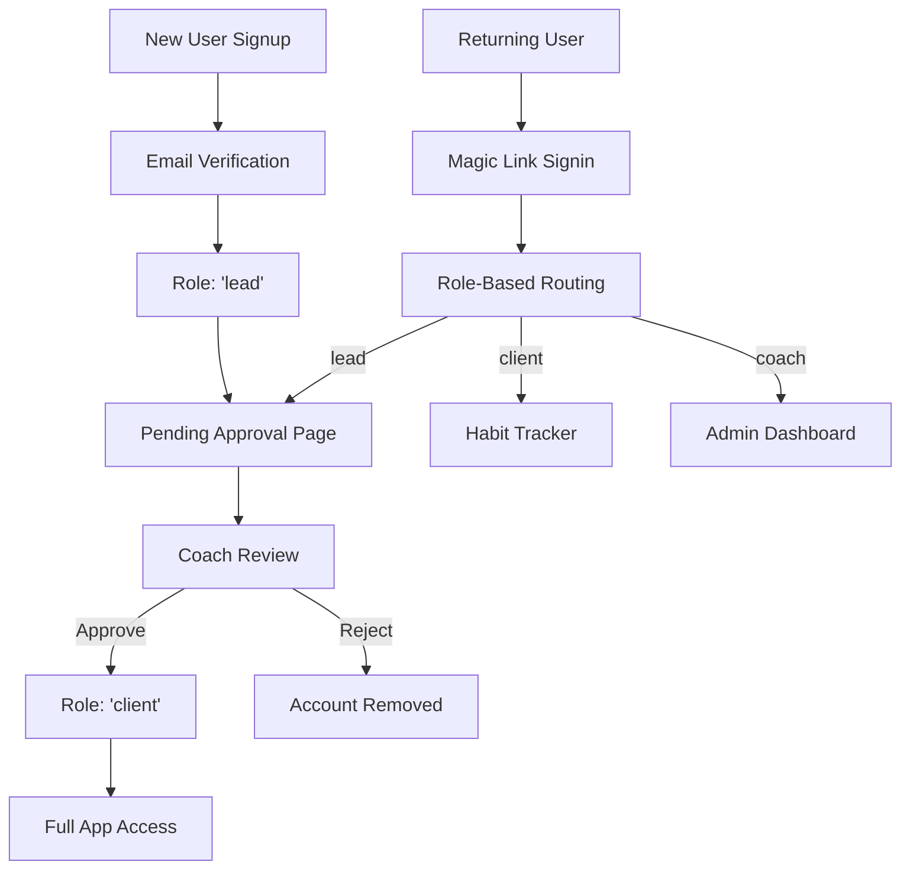

# Final Authentication Architecture Documentation

**Date:** 2025-06-24  
**Status:** ✅ Complete and Production Ready  
**Last Updated:** Authentication System Troubleshooting & Enhancement  

## Overview

This document provides a comprehensive overview of the finalized authentication system for The Catalyst platform, implemented using Supabase Auth with role-based access control via user metadata.

## Architecture Summary

The authentication system uses **Supabase Auth** as the primary identity provider with **user metadata** as the single source of truth for role-based access control. This approach eliminates database inconsistencies and provides a clean, scalable authentication flow.

### Key Design Principles

1. **User Metadata Authority**: `user_metadata.role` is the authoritative source for user roles
2. **Database as Profile Storage**: `spark_users` table stores extended profile information only
3. **Dual Authentication**: Magic link for customers, password option for coaches
4. **Role-Based Routing**: Automatic routing based on user role after authentication
5. **Header-Based API Auth**: Secure token-based authentication for server-side operations

## User Roles and States

### Role Definitions

| Role | Description | Access Level | Database Entry |
|------|-------------|--------------|----------------|
| `lead` | New user pending coach approval | Pending page only | None until approved |
| `client` | Approved user with logging access | Full app access | `spark_users` record created |
| `coach` | Admin user with management access | Admin dashboard | Pre-configured manually |

### User Journey States



## Authentication Flow Implementation

### 1. New User Signup (`/the-spark`)

**Process:**
1. User submits signup form with name, email, goal, notes
2. `sendMagicLinkSignup()` creates Supabase Auth user with metadata:
   ```typescript
   {
     role: 'lead',
     name: userData.name,
     goal: userData.goal,
     notes: userData.notes
   }
   ```
3. User receives email verification link
4. No `spark_users` database record created yet

**Files:** `src/app/the-spark/page.tsx`, `src/lib/auth.ts`

### 2. Email Verification (`/auth/callback`)

**Process:**
1. User clicks verification link from email
2. `supabase.auth.verifyOtp()` validates token
3. Role-based redirect logic:
   ```typescript
   if (userRole === 'coach') router.push('/admin');
   else if (userRole === 'client') router.push('/log');
   else if (userRole === 'lead') router.push('/pending');
   else router.push('/signin');
   ```

**Files:** `src/app/auth/callback/page.tsx`

### 3. Pending Approval (`/pending`)

**Purpose:** Landing page for leads awaiting coach approval  
**Features:**
- Explains approval process
- Provides clear next steps
- Prevents access to protected routes
- Auto-redirects if role changes

**Files:** `src/app/pending/page.tsx`

### 4. Coach Approval (`/admin`)

**Process:**
1. Coach views leads in admin dashboard
2. Coach creates `spark_users` profile for approved lead
3. Admin API updates `user_metadata.role` from 'lead' to 'client'
4. User gains access to `/log` on next signin

**Files:** `src/app/admin/page.tsx`, `src/app/api/admin/approve/route.ts`

### 5. Returning User Signin (`/signin`)

**Process (Enhanced with Dual Authentication):**
1. User enters email address
2. **Coach Email Detection:** If email matches coach patterns, shows password option
3. **Authentication Method Selection:**
   - **Magic Link:** `sendMagicLinkSignin()` → email verification → role-based routing
   - **Password:** `signInWithPassword()` → immediate role-based routing
4. Client users land on `/log`, coaches on `/admin`

**Files:** `src/app/signin/page.tsx`

### 6. Coach Password Setup (`/admin/setup`)

**Process:**
1. Coach accesses setup page (role verification required)
2. Enter and confirm new password
3. `setupUserPassword()` configures password authentication
4. Redirect to admin dashboard
5. Skip option available to continue with magic link only

**Files:** `src/app/admin/setup/page.tsx`

## Database Schema

### Primary Authentication: Supabase Auth Users

```sql
-- Supabase manages this table automatically
auth.users {
  id: UUID PRIMARY KEY,
  email: TEXT,
  user_metadata: JSONB, -- Contains { role: 'lead'|'client'|'coach', name, goal, notes }
  created_at: TIMESTAMP,
  email_confirmed_at: TIMESTAMP
}
```

### Extended Profiles: spark_users Table

```sql
CREATE TABLE spark_users (
  id UUID PRIMARY KEY REFERENCES auth.users(id),
  name TEXT NOT NULL,
  email TEXT NOT NULL,
  age INTEGER,
  height TEXT,
  weight TEXT,
  goal TEXT,
  notes TEXT,
  status TEXT DEFAULT 'active', -- Legacy field, not used for access control
  role TEXT DEFAULT 'client',   -- Legacy field, not used for access control
  created_at TIMESTAMP DEFAULT NOW()
);
```

**Important:** The `status` and `role` fields in `spark_users` are legacy and **not used for access control**. Only `user_metadata.role` determines user permissions.

## Route Protection

### Access Control Logic

Each protected route implements role checking using `user_metadata.role`:

```typescript
// Example from /log/page.tsx
const { data: { user } } = await supabase.auth.getUser();
const userRole = user.user_metadata?.role;

if (userRole === 'coach') {
  router.replace('/admin');
} else if (userRole === 'lead') {
  setStatus('pending');
} else if (userRole === 'client') {
  setStatus('active');
} else {
  setStatus('unauthorized');
}
```

### Protected Routes

| Route | Access | Redirect Logic |
|-------|--------|---------------|
| `/log` | `client` only | `coach` → `/admin`, `lead` → pending state |
| `/admin` | `coach` only | Non-coach → unauthorized |
| `/admin/setup` | `coach` only | Password setup for coaches |
| `/pending` | `lead` only | `client` → `/log`, `coach` → `/admin` |

## API Security

### Role Verification (Enhanced with Header Authentication)

Admin API routes now use header-based authentication:

```typescript
// Enhanced pattern from /api/admin/entries/route.ts
export async function GET(req: Request) {
  // Extract auth token from request headers
  const authHeader = req.headers.get('Authorization');
  const token = authHeader?.replace('Bearer ', '');
  
  if (!token) {
    return NextResponse.json({ error: 'No authorization token provided' }, { status: 401 });
  }
  
  // Verify token and get user
  const { data: { user }, error: authError } = await supabase.auth.getUser(token);
  
  if (authError || !user) {
    return NextResponse.json({ error: 'Invalid or expired token' }, { status: 401 });
  }
  
  // Check coach role
  const isCoach = user.user_metadata?.role === 'coach';
  if (!isCoach) {
    return NextResponse.json({ error: 'Forbidden' }, { status: 403 });
  }
}
```

### Admin Functions

- `hasCoachAccess()`: Verifies current user has coach role
- `getCurrentUserRole()`: Returns current user's role from metadata
- `getCurrentUser()`: Returns user and profile data

**Files:** `src/lib/auth.ts`

## Configuration

### Supabase Project Settings

**Site URL:** `https://whatcomesnextllc.ai`

**Redirect URLs:**
- `https://whatcomesnextllc.ai/*`
- `http://localhost:3000/*` (development)

**Email Templates:** Custom templates configured for verification and password reset

### Environment Variables

```env
NEXT_PUBLIC_SUPABASE_URL=your_supabase_url
NEXT_PUBLIC_SUPABASE_ANON_KEY=your_anon_key
SUPABASE_SERVICE_ROLE_KEY=your_service_key (server-side only)
```

## Security Considerations

### Access Control
- **Single Source of Truth**: Only `user_metadata.role` determines access
- **Server-Side Verification**: All API routes verify user roles server-side
- **JWT-Based**: Role information travels in JWT, no database queries needed
- **Stateless**: No session storage, relies on Supabase Auth state

### Data Protection
- **Row Level Security**: Database policies restrict data access by user
- **Admin Separation**: Coach functions isolated to admin routes
- **Input Validation**: All forms use Zod schema validation

## Migration History

### Previous Architecture Issues
- **Mixed Authority**: Previously checked both `user_metadata` and database roles
- **Inconsistent Routing**: Auth callback redirected to signin instead of proper destination
- **Database Dependencies**: Access control relied on database queries instead of JWT metadata

### Resolution
- **Standardized Metadata**: Made `user_metadata.role` the single authority
- **Completed Auth Flow**: Added role-based routing in auth callback
- **Clean Architecture**: Removed conflicting role checks

## Testing Instructions

### Manual Testing Flow

1. **New User Signup:**
   ```
   1. Go to /the-spark
   2. Fill out signup form
   3. Check email for verification link
   4. Click link → should land on /pending
   5. Verify user has role='lead' in Supabase auth
   ```

2. **Coach Approval:**
   ```
   1. Sign in as coach → /admin
   2. See pending lead in dashboard
   3. Approve lead
   4. Verify user role updated to 'client'
   5. Verify spark_users record created
   ```

3. **Client Access:**
   ```
   1. Approved user signs in
   2. Should land on /log automatically
   3. Can upload files and view history
   ```

4. **Role Protection:**
   ```
   1. Try accessing /admin as non-coach → should be blocked
   2. Try accessing /log as lead → should see pending message
   ```

### Automated Testing

**Note:** Comprehensive test suite recommended for production deployment.

```typescript
// Example test structure
describe('Authentication Flow', () => {
  test('new user signup creates lead role');
  test('email verification redirects based on role');
  test('coach can approve leads');
  test('approved users can access /log');
  test('unauthorized users cannot access admin');
});
```

## Monitoring and Analytics

### Authentication Events

Monitor these key events:
- User signups (`auth.user_signup`)
- Email verifications (`auth.email_verified`)
- Role updates (`auth.role_changed`)
- Failed login attempts (`auth.login_failed`)

### Success Metrics

- Signup completion rate (signup → email verification)
- Approval rate (leads → clients)
- Authentication error rates
- User retention by role

## Future Enhancements

### Short-term (1-2 months)
- [ ] Add email notifications for approval status changes
- [ ] Implement coach role management UI
- [ ] Add audit logging for role changes
- [ ] Create comprehensive test coverage

### Long-term (3+ months)
- [ ] Add OAuth providers (Google, Apple)
- [ ] Implement more granular permissions
- [ ] Add user self-service password reset
- [ ] Consider admin tool separation

## Troubleshooting

### Common Issues

**User stuck on pending page:**
- Check `user_metadata.role` in Supabase auth
- Verify coach approved user correctly
- Ensure role update completed

**Authentication loops:**
- Clear browser localStorage
- Check email verification status
- Verify redirect URLs in Supabase config

**Admin access denied:**
- Verify user has `role: 'coach'` in metadata
- Check Authorization header is being sent with valid token
- Confirm API route receives and processes Bearer token correctly
- Test with browser network tab for 401/403 responses

### Support Commands

```sql
-- Check user role
SELECT user_metadata->>'role' as role, email 
FROM auth.users 
WHERE email = 'user@example.com';

-- Update user role manually
UPDATE auth.users 
SET user_metadata = jsonb_set(user_metadata, '{role}', '"client"') 
WHERE email = 'user@example.com';

-- View pending leads
SELECT email, user_metadata->>'name' as name 
FROM auth.users 
WHERE user_metadata->>'role' = 'lead';
```

## Conclusion

The finalized authentication architecture provides:

✅ **Clean Role Management**: Single source of truth via user metadata  
✅ **Complete User Journeys**: From signup through approval to active use  
✅ **Dual Authentication**: Magic link for customers, password for coaches  
✅ **Secure API Access**: Header-based token authentication for server operations  
✅ **Scalable Design**: Role-based system supports future permission expansion  
✅ **Mobile Ready**: Standard Bearer token authentication compatible with mobile apps  
✅ **Production Ready**: Comprehensive error handling and security measures  

This system successfully eliminates all previous authentication issues while providing a robust, future-proof foundation for The Catalyst platform's authentication needs.

---

**Documentation Maintainer:** Development Team  
**Next Review Date:** 2025-09-24 (Quarterly)  
**Version:** 2.0 (Authentication Enhancement & Troubleshooting Complete)